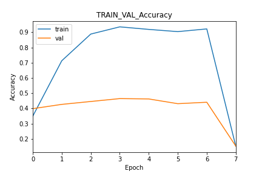
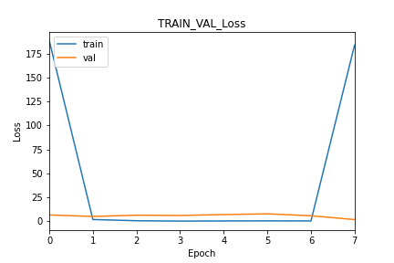
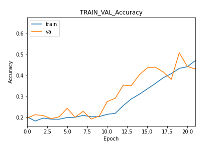
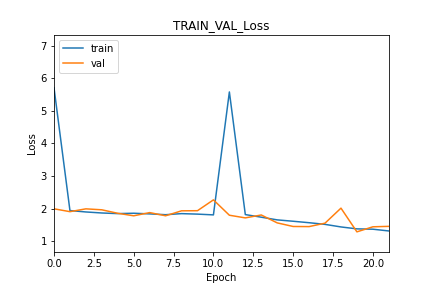
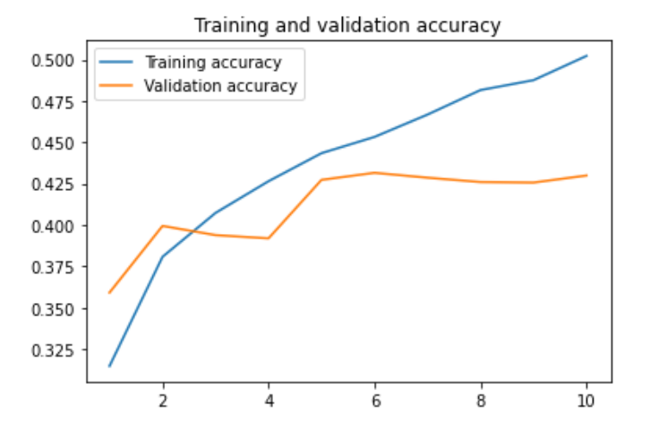
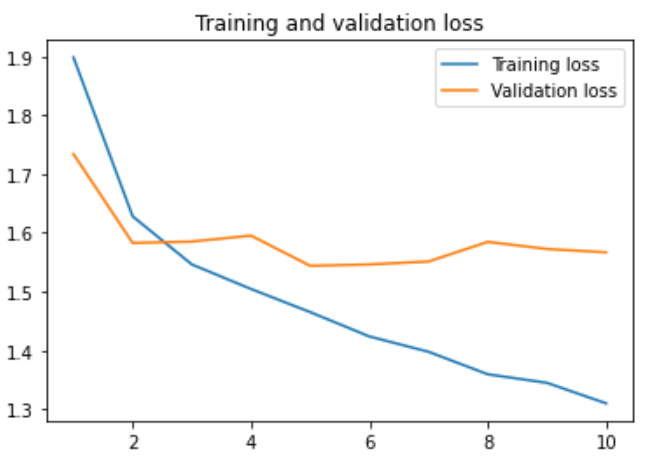

# Rapport classification de felin


## **Description**


Ce projet permet de classifier une image de félin selon son espèce. Il est réalisé dans le cadre de l'unité [[5202C] IA et Jeux](https://perso.esiee.fr/~buzerl/IA/310%20Projet_1/ProjetClassif.html#rendu).


La classification se fait selon 7 espèces de félin différentes. Parmi elles, nous retrouvons :
- l'*Acinonyx jubatus* ou guepard
- le *Neofelis nebulosa* ou panthère nebuleuse
- le *Panthera leo* ou lion
- le *Panthera tigris* ou tigre
- le *Panthera onca* ou jaguar
- le *Panthera pardus* ou leopard
- le *Puma concolor* ou plus simplement puma


Nous avons sélectionné les espèces de grands félins les plus courants ayant des similarités entre eux. Le but étant de réussir à classifier correctement ces félins malgré leurs caractéristiques physiques semblable comme le gabarit (lion et tigre), leurs couleurs (guépard, léopard, jaguar ou puma et lion), leurs tâches (jaguar et léopard) où la différence peut être minime.


  Nous aurions pu ajouter d'autres espèces comme la panthère des neiges, le lynx ou encore le caracal. Cependant, le processus de création de la base de données est une étape chronophage et fastidieuse et par soucis pratique et de temps, nous avons choisi de ne représenter que les 7 classes ci-dessus.


Détaillons maintenant comment nous avons créé notre base de données.
<br>


## **Constitution de la base de donnée**


Afin de créer notre base de données, il nous fallait un grand nombre d'images par catégorie. Nous nous sommes alors rendu sur des sites libres de droit tel que Flickr, stocklib ou istockphoto pour ainsi télécharger les images en grand nombre.


Nous avons rencontré plusieurs problèmes :


1. Sur Flickr, les images que nous téléchargeons sont principalement des images de petits formats n'ayant pas une résolution importante. Ce qui n'est pas vraiment optimal.
2. Sur stocklib ou istockphoto, les images étaient sur plusieurs pages différentes. Il fallait alors télécharger les pages une par une jusqu'à avoir un nombre suffisant d'images.
3. Il était possible que sur les différents sites d'images libres de droit, il n'y ait pas assez d'images pour une espèce donnée. C'était le cas pour la panthère nébuleuse. Nous avons alors combiné plusieurs sites avec le risque de dupliquer quelques images.
4. Une fois les images téléchargées, il a fallu trier les différentes classes une par une afin de retirer certaines images qui n'avaient pas de rapport, ou qui n'étaient pas dans la bonne catégorie.


Ce processus était très long et nous a pris énormément de temps. C'est pour cela que nous avons limité notre base de données à 7 classes différentes d'environ 2000 images chacunes.


## **Prétraîtement**


Afin de rendre les images interprétables par un réseau de neurones, nous avons écrit un script en local permettant de :
> - Charger l’ensemble des images présentes dans un répertoire
> - De les recadrer (crop ou scale) dans un format carré
> - De les redimensionner
> - De les fusionner dans un tableau Numpy
> - D’exporter ce tableau sur le disque


Cette étape a posé quelques problèmes. En effet, nous avons d'abord essayé de créer un tableau numpy fusionnant l'ensemble des images contenues dans une classe et de créer autant de tableaux que de classes. Cependant, les différentes classes transformées en tableau numpy étaient devenues extrêmement lourdes (2,64 Go) et lorsque nous essayions de charger les tableaux sur colab, nous avons eu des problèmes de mémoire.


Dans un premier temps, nous avons essayé de réduire le nombre d'images à 1250 par classe, ce qui a permis de réduire le poids des tableaux numpy (1,41 Go). Malgré tout, le problème persistait.


Nous avons alors créé un nouveau script qui permettait de construire un tableau numpy contenant toutes les images et un tableau contenant les labels.


Le résultat était moins lourd et nous avons pu passer à la création du jeu d'entraînement et du jeu de test.


## **Premier réseaux de neurone**


En tant que premier réseau, nous avons commencé par créer un réseau simple que nous avons ajusté afin d'en améliorer les performances.


Avant de parler du réseau en lui-même, nous avons mis en place un Early Stopping permettant d'arrêter l'entraînement lorsque le réseau n'apprend plus et un CSV_logger afin d'extraire certaine métrique de notre réseau.


Pour le premier réseau, nous sommes partis sur le modèle suivant :
```
model.summary()
>>>
Model: "sequential"
_________________________________________________________________
 Layer (type)                Output Shape              Param #  
=================================================================
 conv2d (Conv2D)             (None, 219, 219, 32)      416      
                                                                 
 max_pooling2d (MaxPooling2D  (None, 109, 109, 32)     0        
 )                                                              
                                                                 
 flatten (Flatten)           (None, 380192)            0        
                                                                 
 dense (Dense)               (None, 64)                24332352  
                                                                 
 dense_1 (Dense)             (None, 7)                 455      
                                                                 
=================================================================
Total params: 24,333,223
Trainable params: 24,333,223
Non-trainable params: 0
_________________________________________________________________
```
<br>
Voici les performances du modèle :


Train et Val accuracy            |  Train et Val loss
:-------------------------:|:-------------------------:
 | 


Nous obtenons une accuracy très basse sur le test set.


Comme nous pouvons le voir, notre modèle a overfitté.
Cela peut être dû à plusieurs facteurs. Dans un premier temps, nous allons essayer de réduire le surapprentissage. Pour cela,
nous avons juste ajouté 2 nouvelles couches convolutionnelles avec un noyau de (3, 3) afin de capturer plus de caractèristiques sur nos données d'entrée et nous avons rajouté un dropout afin de réduire l'overfitting.
Suite à l'entraînement, nous pouvions voir que notre modèle perdait en stabilité et sur-apprenait toujours légèrement.


Nous avons alors cherché un moyen d'améliorer la stabilité de notre modèle et ainsi en améliorer les performances. Une des méthodes que nous avons retenues était la normalisation par batch à l'aide de la couche ```BatchNormalization()``` de [Keras](https://keras.io/api/layers/normalization_layers/batch_normalization/). Elle permet de normaliser les activations intermédiaires dans une couche pour avoir une moyenne proche de zéro et une variance proche de 1. Cela permet ainsi d'améliorer la stabilité et la rapidité de la convergence de l'apprentissage.

Lors de l'entraînement nous avons pu constater que le modèle ne s'arrêtait plus prématurément au bout de 8 epochs. De plus, comme en démontre ces courbes, le modèle n'overfit plus malgré des performances assez basses. Nous avions a peu près 64% d'accuracy sur le test set.  


Train et Val accuracy            |  Train et Val loss
:-------------------------:|:-------------------------:
 | 


Voici alors le modèle finale :
```
Model: "sequential"
_________________________________________________________________
 Layer (type)                Output Shape              Param #  
=================================================================
 conv2d (Conv2D)             (None, 218, 218, 32)      896      
                                                                 
 max_pooling2d (MaxPooling2D  (None, 109, 109, 32)     0        
 )                                                              
                                                                 
 batch_normalization (BatchN  (None, 109, 109, 32)     128      
 ormalization)                                                  
                                                                 
 conv2d_1 (Conv2D)           (None, 107, 107, 64)      18496    
                                                                 
 max_pooling2d_1 (MaxPooling  (None, 53, 53, 64)       0        
 2D)                                                            
                                                                 
 batch_normalization_1 (Batc  (None, 53, 53, 64)       256      
 hNormalization)                                                
                                                                 
 conv2d_2 (Conv2D)           (None, 51, 51, 128)       73856    
                                                                 
 max_pooling2d_2 (MaxPooling  (None, 25, 25, 128)      0        
 2D)                                                            
                                                                 
 batch_normalization_2 (Batc  (None, 25, 25, 128)      512      
 hNormalization)                                                
                                                                 
 flatten (Flatten)           (None, 80000)             0        
                                                                 
 dense (Dense)               (None, 128)               10240128  
                                                                 
 dropout (Dropout)           (None, 128)               0        
                                                                 
 dense_1 (Dense)             (None, 7)                 903      
                                                                 
=================================================================
Total params: 10,335,175
Trainable params: 10,334,727
Non-trainable params: 448
_________________________________________________________________
```


Afin d'améliorer un peu plus les performances de notre modèle, nous voulions faire de la data augmentation dessus. Cependant, nous nous sommes retrouvés avec des problèmes de mémoire RAM.


## **Modele pré entraîné**


Il nous était demandé d'utiliser un modèle pré entraîné et de le faire tourner sur nos données. Nous avons alors regardé l'ensemble des réseaux de neurones disponibles sur [Keras](https://keras.io/api/applications/). 

Notre choix s'est porté sur le NASNetMobile car c'est un modèle léger et rapide à exécuter.
L'entraînement a été plus long que pour le modèle précédent pour cause que nous n'avions plus accès au GPU de google Colab en dépassant l'utilisation gratuite de celui-ci.

Nous obtenons une accuracy de 43% sur le test set.

Train et Val accuracy            |  Train et Val loss
:-------------------------:|:-------------------------:
 | 

Nous pouvons voir que c'est performance sont un peu médiocre. Cependant, en ré effectuant l'entrainement avec plus d'epoch et en y ajoutant de la data augmentation, nous pourrions facilement en augmenter les performances.


## **User Guide**

Afin de faire tourner le projet, il faut d'abord lancer le fichier ```pretraitement.py``` en local afin de créer les tableaux numpy.

*<div style="text-align: right"> Shayan ARNAL - Axel COCHET</div>*

